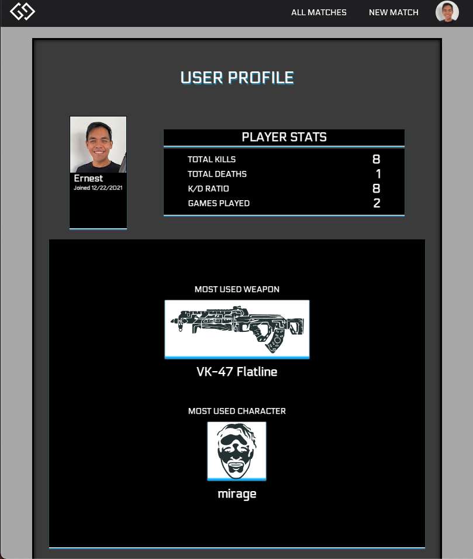

# GitGud.GG
-----------
## Overview
-----------

This project is a browser-based Note taking tracking application that allows Users to post and keep track of their match history for a game they want to improve on – in this case, it’s for the game called Apex Legends. This simple CRUD Note-taking app utilizes Node.js (Express) and MongoDB as well as HTML/CSS/JS.

[Click here to access the site!](https://git-gud-gg.herokuapp.com/)

## Screenshots
---
|Splash / Login                    |  Match Index                   | 
|:------------------------:|:-------------:             |
  |   |

---
| Match Detail 1 |  Match Detail  | 
|:--------:|:-----------:|
| |   |

---

|  Add New Match Form  |  User Profile   |
|:------------------------:|:-------------:|
  |  

## Technologies Used
---
Back-end: Node.JS, Express, MongoDB, Mongoose
Front-end: HTML, CSS, JavaScript, EJS.

---

### What's Next?
- AAU, I should be able to delete the notes that I have posted.

### Known Bugs?
- Other than the alignments, none.

---
All rights reserved. Ernest Bruno 2021.